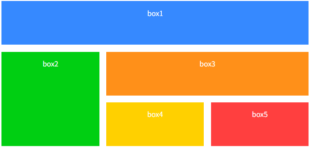

# html

웹 프로그래밍(양선옥)

- 디지털 트랜스폼: 오프라인의 모든 정보와 서비스를 온라인으로 옮기는 작업
- 웹 표준을 지켜야 한다.
- 표준 언어: HTML, CSS, 자바스크립트

프로토콜

- HTTP, FTP, TCP-IP, UDP

HTTPS: HTTP에 암호화 추가

웹 접근성? -> 모든 사람이 접근 가능해야 함.

---

<디지털 전환법?>

웹 문서

HTML(표기) – CSS(스타일) – JavaScript(동작 반응)

시맨틱 태그?

- 이름만 봐도 알 수 있는 html 태그

+ 사이트 구조 이해, 다양한 구조의 웹 문서 표기 가능

---

<h>: 제목 표시(1이 제일 크고, 6이 제일 작음)

<p>: 텍스트 단락

<br>: 줄 바꾸기

<p>: 문단

&nbsp; à 스페이스바 역할

<hr>: 가로줄 표시?

<strong>, <b>: 굵게 표시

<em>, <i>, <cite>: 이탤릭체로 표시(순서대로 강조, 단순, 저작물 제목 표시)

<blockquote>: 인용문 넣기(들여쓰기)

<ol>: 순서 있는 목록

<li>: 순서 없는 목록

<dl>, <dt>, <dd>: 설명 목록(목차)

+ <dl>은 접근성 강화 목적

Dt는 이름 지정, dd는 값 지정

---

표

<table>: 표 전체

<caption>: 표 제목

<tr>: 행, <td>: 열, <th>: 제목 셀

<th>를 넣으면 제목이 된다. 행을 제목으로 하려면 tr 하나에 넣으면 되고, 열을 제목으로 하려면 각 tr의 첫째줄을 바꾸면 된다.

<colspan=”2”>: 열병합

<rowspan=”2”>: 행병합

+ 뒤에 붙는 2는 몇 개를 병합할지~

+ 열병합을 하고, 해당 tr부분의 한 열을 주석 처리하면 되고

+ 행병합을 하면 다음 tr 부분에서 행병합을 한 행과 같은 줄의 td를 주석 처리하면 자연스럽게 된다.

---

<style>: 이쁘게 하기~(table, th, td)

<thead>, <tbody>, <tfoot> 태그는 접근성을 높임

<colgroup>: 열 개수만큼 태그를 넣으면 묶기 가능

<col>을 각 행에 넣어줘야 함

<object>: 다양한 개체

<a href=”(연결하고자 하는 사이트 html” targer=””>

---

target 속성 내 선택지 중

1. _blank: 새로운 창에서 열기

html에서 상대경로는 보통 내부 자료를 연결할 때 사용

절대경로는 웹 사이트와 같은 외부 경로를 연결할 때 사용

- 이미지를 웹 사이트에 띄울 때, 

속성

- method: 어떻게 넘겨줄 건지~ (get 과 post 가 속성값으로 쓰임)
- get: 주소 표시줄에 사용자의 입력 값이 드러남
- post: 입력 내용 길이 제한 없고, 입력내용 드러나지 않음
- name: 사용자 폼의 이름 지정
- action: 태그 안 내용 처리 서버 프로그램 지정
- target: 스크립트 파일을 현재 창이 아닌 다른 위치에서 열도록 함

<fieldset>: 요소들을 묶어줌 + <legend> : 묶인 요소의 집합 이름 지정

---

아이디 선택자:

1. body 태그에 하나만 존재
2. 정의한 후, 한 페이지에서 한 번만 사용

클래스 선택자:

1. 여러 개의 태그에 동시 적용
2. 재사용 가능

**CSS 명시도?**

---

전체선택자 0

타입선택자 1

클래스선택자 10

아이디선택자 100

명시도가 높은 스타일 우선 적용

같은 명시도의 스타일이 충돌하면 나중에 정의된 스타일이 적용

인라인 스타일은 명시도 1000으로 가장 강함

!important는 명시도와 관계없이 가장 우선 순위 가짐

---

폰트 관련 속성

- family à <body> 태그 스타일에서 정의하여 문서 전체에 적용
- size
- weight
- style

폰트 단위: px, em

폰트 설정 시 양식 à style weight size family 서순

color 속성

1. 색상 이름 표기법
2. hsl/hsla 표기법
3. 16진수 표기법 à (#ffffff 같은)
4. /rgb/rgba 표기법

text-align 속성 à 정렬 방법에는 left, right, center, justify 가 많이 쓰인다,

line-height à 문단의 줄 높이 지정 및 세로 정렬에 활용

---

레이아웃을 구성하는 CSS 박스 모델

marzin( border( padding( box ) ) ) 형태로 구성

box-sizing

à border-box: 테두리까지 포함해서 너빗값 지정

à content-box: 콘텐츠 영역만 너빗값 지정(기본값)

box-shadow

à기본형: box-shadow: <수평 거리> <수직 거리> <흐림 정도> <번짐 정도> <색상>

박스 모델은 4개 방향의 값을 한꺼번에 지정하는 경우, top, right, bottom, left 순 지정

- 마진을 이용하면 요소와 요소 간격 조절 가능

웹 요소 위치 지정

- 정적 배치: position static
- 상대 배치: position relative
- 절대 배치: position absolute
- 고정 배치: position fixed
- 유동 배치: position float left 또는 float right

포지셔닝 – relative

overflow à 부모 요소의 범위를 벗어날 때 어떻게 처리할 지를 지정하는 속성

- visible à 영역을 벗어나도 그대로 보여지도록 처리(기본값)
- hidden
- scroll
- auto

박스테두리 활용하기

quiz-2.html 파일 실습

심화버전( lab.html )

배경

- border-box à 테두리까지 표시
- padding-box à padding box까지 표시
- content-box à content box까지 표시

배경 이미지

- 배경 이미지 파일 경로 지정하여 적용

```css
section {
  width: 200px;
  height: 200px;
  border: 1px solid #000;
  background-image: url(../images/pattern.png);
}
```

+ background-repeat 를 통해 이미지 반복을 통한 채우기 가능

- repeat 은 채우기, no-repeat는 단일 이미지, repeat-x 또는 y 는 각 축 반복

+background-position은 no-repeat와 함께 쓰이며, 이미지 위치 지정

- background-origin à 배경 이미지 배치 기준 설정
- background-attachment à 이미지 화면에 고정

```css
body {
	background-image: url("images/bg2.png"); /* 문서 전체 배경 이미지 */
	background-repeat: no-repeat;
	background-position: right top;
	background-attachment: fixed;
}
```

+background-size

- auto à 기본값
- contain à 요소 안에 배경 이미지가 다 들어오도록 이미지 확대/축소
- cover à 요소를 완전히 덮도록 배경 이미지 표시

---

선택자

자식 선택자? à 부모 스타일의 요소를 하위 클래스에 모두 적용시키고 싶으면 스페이스바 쓰고 이어붙이면 됨.

- ex) section 하위로 p 가 있으면,

```css
section p{
  color: blue;
}
```

이때, 스페이스바 대신 > 를 넣으면 전체 하위클래스가 아닌 한 단계 자식 클래스에만 적용

- 인접 형제 선택자? à 같은 부모를 가진 형제 요소 중 첫 번째 동생 요소에만 스타일 적용
- 요소1과 요소2 사이에 + 기호 사용

```css
h1 + p {
  background-color: #222;
  color: #fff;
}
```

- 인접이 아니라 모든 형제 요소에 적용시키고 싶으면 ~ 쓰면 됨.

```css
h1 ~ p {
  background-color: #222;
  color: #fff;
}
```

- 속성 선택자 à 지정한 속성을 가진 요소를 찾아 스타일 적용

```css
a[target="_blank"] {
  background: url(images/newwindow.png) no-repeat center right;
  padding: 30px;
}
```

- [속성 ~=값] 선택자 à 해당 값의 클래스에만 적용

```css
[class~="button"] {
	box-shadow: rgba(0, 0, 0, 4) 4px 4px;
	border-radius: 5px;
}
```

- [속성 |= 값] 선택자 à 특정 값이 포함된 속성을 가진 요소를 찾아 스타일 적용
- [속성 ^=값] 선택자 à 특정 값으로 시작하는 속성
- [속성 $= 값] 선택자 à 특정 값으로 끝나는 속성
- [속성 *= 값] 선택자 à 값의 일부가 일치하는 속성

---

가상 클래스

- 사용자 동작에 반응하는 가상 클래스 선택자
- :link à 방문하지 않은 링크에 스타일 적용
- :visited à 방문한 링크에 스타일 적용
- :active à 웹 요소를 활성화했을 때의 스타일 적용
- :hover à 웹 요소에 마우스 커서를 올려놓을 때의 스타일 적용
- :focus à 웹 요소에 초점이 맞추어졌을 때의 스타일 적용

+ 순서 à link -> visited -> hover -> active

- 클래스 구성요소의 순서별 스타일 지정

```css
/* container의 첫번째 자식 배경색 변경 */
.container :first-child {
  background-color: yellow;
}
/* container의 p요소 중 2번째 자식 요소에 배경과 글자색 변경 */
.container p :nth-of-type(2) {
  background-color: green;
  color: yellow;
}
/* container의 마지막 자식 테두리 지정 */
.container :last-child {
  border: 1px solid gray;
  border-radius: 3px;
}
/* container의 div 요소의 유일한 자식에 대해 배경색 변경 */
.container :only-child {
  background-color: gray;
}
```

- :nth-child( ) à 괄호 안에 순서를 넣는데, Odd, Even 같은 형식도 지정 가능

```css
/* container의 3번째 자식 배경색 변경 */
.container :nth-child(3) {
  background-color: green;
}
.container :nth-child(even) {
  background-color: yellow;
}
/* Do it! 단락의 첫번째 글자('가') 크기 2배(2em), 굵게(bold) 스타일 지정하기 */
p::first-letter {
  font-size: 2em;
  font-weight: bold;
}
```

- first-line으로 하면 첫째줄 전체가 강조표시된다

```css
/* Do it! 가상 요소를 사용해 h1 요소 앞부분에 내용 스타일(*) 추가하기 */
h1::before {
	content: "*";
	color: red;
	margin-right: 5px;
}
h1::after {
	content: " ";
	margin-left: 10px;
}
```

---

---

11장 플렉스 박스 레이아웃

1. justify-content 로 주축 지정
2. 주축을 가로로 했다면 교차축은 세로, 반대도 마찬가지
3. CSS를 사용해 align-items 활용, 교차축 정렬
4. align-content 로 교차축에 여러 줄로 표시 및 정렬
5. align-self 로 플렉스 항목을 개별적으로 정렬하는 방법도 있음

flex-wrap 속성

```css
#opt1 {
	flex-flow: row-wrap;
}
#opt2 {
	flex-flow: row-wrap;
}
/* 화면 크기에 따른 줄바꿈 지정 */
```

justify-content 속성

```css
#opt1 { justify-content: flex-start; }
#opt2 { justify-content: flex-end; }
#opt3 { justify-content: center; }
#opt4 { justify-content: space-between; }
#opt5 { justify-content: space-around; }
#opt6 { justify-content: space-evenly; }
/* 주 축의 정렬 방법 지정 */
```

align-items 속성

```css
#opt1 { align-items: flex-start; }   
#opt2 { align-items: flex-end ; }     
#opt3 { align-items: center; }
#opt4 { align-items: baseline; }
#opt5 { align-items: stretch; } 
/* 교차축 정렬 방법 지정 */
```

align-self 속성

```css
#box1 {
  align-self: flex-start;
}
#box3 {
  align-self: stretch;
}
/* box1은 교차축 시작점, box3는 교차축에 가득 차게 배치 */
```

align-content 속성

```css
/* align-content 값을 다양하게 적용 */
#opt1 { align-content: flex-start }
#opt2 { align-content: flex-end }
#opt3 { align-content: center }
#opt4 { align-content: space-between }
#opt5 { align-content: space-around }
#opt6 { align-content: stretch }
```

플렉스 박스 레이아웃을 사용해 화면 중앙에 배치하기

```css
body {
  background: url("images/bg5.jpg") no-repeat left top fixed;
  background-size: cover;
  /* 플렉스컨테이너로 지정, 요소를 가로, 세로 중앙 정렬 */
  display: flex;
  justify-content: center;
  align-items: center;
  min-height: 100vh;
}
/* 화면 크기에 상관없이 버튼이 항상 가운데 정렬됨 */
```

```css
/* center2.css 파일 --> 컨테이너 설정, 배경 이미지 지정
                        중앙 정렬 */
.container {
    width: 100%;
    height: 100vh;
    background: url("../images/bg5.jpg") no-repeat left top fixed;
    background-size: cover;
    display: flex;
    justify-content: center;
    align-items: center;
}
.content{
    background-color: #ccc;
    font-size: 1.2em;
    padding: 1em 2em;
    border: none;
    border-radius: 5px;
    box-shadow: 1px 1px 2px #fff;
    text-align: center; /* 중앙정렬 */
}
```

개별 아이템이 공간을 어떻게 차지할지 조정하는 방법

- flex-basis: 플렉스 항목의 기본 크기

```css
.box {
  background-color: #222;
  flex-basis: 150px;
}
```

- flex-grow: 남은 공간을 채우기 위해 플렉스 항목을 늘림(기본 0)

```css
/* flex-grow 로 남는 공간에 따른 입력상자와 
버튼의 영역을 4:1 비율로 나누어 차지하도록 지정하기 */
.input-box {
  flex-grow: 4;
  padding: 10px;
}

.search-btn {
  flex-grow: 1;
  padding: 10px;
  background-color: aqua;
  border: none;
}
```

- flex-shrink: 공간이 부족할 경우 플렉스 항목을 줄임(기본 1)
- flex: 앞의 3가지 속성을 한꺼번에 지정

```css
/* flex 로 남는 공간에 따른 입력상자와 
버튼의 영역을 4:1 비율로 나누어 차지하도록 지정하기 */
.input-box {
  flex: 4 1 0; /* 가운데는 shrink */
  padding: 10px;
}

.search-btn {
  flex: 1 1 0;
  padding: 10px;
  background-color: aqua;
  border: none;
}
```

```css
/* 화면 너비가 768px 이상일 경우 .column을 3개씩 배치하는 
미디어 쿼리 작성 */
@media screen and (min-width: 768px){
  #container{
    padding: 1em;
  }
  .row{
    display: flex;
    flex-wrap: wrap;
    padding: 2em 1em;
    text-align: center;
  }
  .column{
    flex: 0 0 33.3%;
  }
}
```

grid 속성

```css
.container {
        width: 600px;        
        border: 2px solid #222;
        display:grid;
        grid-template-columns:repeat(3, 1fr);  /* 열 3개 */ 
        gap:20px 30px;  /* 행 간격 20px, 열 간격 30px  */
      }
```

grid 라인을 사용한 배치

```css
.box1 {
  background-color:#3689ff;      
  grid-column: 1 / -1;  /* grid-column:1 / 4; */
  grid-row-start: 1;   /* grid-row: 1 / 2; */
}
.box2 {
  background-color:#00cf12;
  grid-row:2 / -1;  /* grid-row: 2 / 4; */        
  grid-column-start:1;   /* grid-column: 1 / 2; */
}
.box3 {
  background-color:#ff9019;
  grid-column:2 / -1;  /* grid-column: 2 / 4; */   
  grid-row-start: 2;   /* grid-row: 2 / 3; */
}
.box4 {
  background-color:#ffd000;
  grid-column-start:2;  /* grid-column: 2 / 3; */
  grid-row-start:3;  /* grid-row: 3 / 4; */
}
.box5 {
  background-color:#ff3f3f;
  grid-column: 3 / -1;  /* grid-column: 3 / 4; */
  grid-row: 3 / -1;  /* grid-row: 3 / 4; */
}
```



grid 라인을 사용해 배치하는데, 템플릿 영역을 활용하기

```css
.container {
  width: 700px;
  display: grid;
  grid-template-rows: repeat(3, 100px);
  grid-template-areas:
    "box1 box1 box1"
    "box2 box3 box3"
    "box2 box4 box5";
  gap: 1rem;
}
.box1 {
  background-color: #3689ff;
  grid-area: box1;
}
.box2 {
  background-color: #00cf12;
  grid-area: box2;
}
.box3 {
  background-color: #ff9019;
  grid-area: box3;
}
.box4 {
  background-color: #ffd000;
  grid-area: box4;
}
.box5 {
  background-color: #ff3f3f;
  grid-area: box5;
}
```

각 영역을 grid-area로 지정한 후(3행 3열의 형식), 각 박스에 영역 배치
—> 위와 같은 결과가 나옴.

- 뷰포트 → 실제 내용이 표시되는 영역
뷰포트를 지정하면 기기 화면에 맞춰 내용 표시됨.

```css
<meta name="viewport" content="width=device-width, initial-scale=1" />
```

웹 크기에 따른 이미지 사이즈 조절

```css
.top {
  max-width: 100%;
  height: auto;
}
```

object-fit 속성 → 이미지/비디오 가로세로비율 유지 및 크기 조절

```css
.fill {
	object-fit: fill;
}
.contain {
	object-fit: contain;
}
.cover {
	object-fit: cover;
}
.none {
	object-fit: none;
}
.scale-down {
	object-fit: scale-down;
}
```

미디어 쿼리 → 접속 장치에 따른 특정 CSS 스타일 사용법