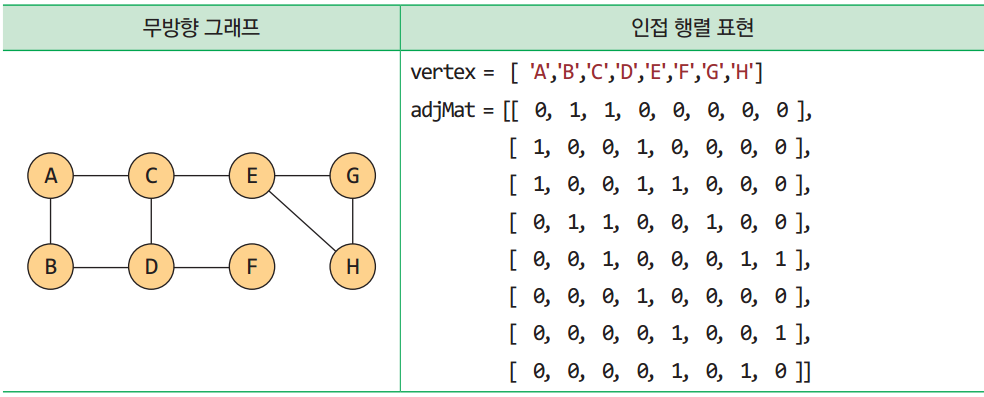

# 자료구조

복합 자료 구조
→ 선형 자료구조: 자료들을 일렬로 나열(리스트, 스택, 큐, 덱 등)
→ 비선형 자료구조: 한 줄로 나열하기 어려운 자료(트리, 그래프 등)

---

알고리즘
→ 조건: **입력 / 출력 / 명백성 / 유한성 / 유효성**
→ 기술 방법: 자연어, 흐름도, 유사코드, 프로그래밍 언어

---

추상 자료형
→ 인터페이스만 공개( 나머지는 정보은닉)

---

알고리즘 성능 향상을 위한 복잡도 분석
→ 실제 구현 없이 알고리즘의 효율성 분석?
: 연산 횟수를 대략적으로 계산, 환경 무관 평가, 입력 개수에 따른 실행시간 및 필요 메모리 증가 형태 분석

→ 알고리즘을 구성하는 연산 횟수 분석?
: 시간복잡도 함수 활용—> 연산의 수를 n의 함수로 표현

→ 점근적 표기
: 계수 없이 최고차항만으로 단순하게 표현?( 연산량이 많을 때 )

→ 빅오표기법
: 함수의 상한을 표시하는 것 —> 최소 차수 함수로 표기된 경우 유의미.
→ 빅오메가?
: 함수의 하한을 표시하는 것
→ 빅세타?
: 동일한 함수로 상한과 하한을 표시하는 것

---

알고리즘 성능 향상과 관련된 입력 데이터
→ 입력 데이터에 의한 실행 시간 차이 ( 최악의 경우가 가장 중요함 )

---

리스트 구현 방식
→ 배열(array) 구조
: 같은 자료형 데이터를 한꺼번에 만들 때 사용( [ ] )
  용량 변경이 어렵고, 중간 연산(추가, 삭제, 수정)이 비효율적임

→ 연결된 구조?
: 링크를 이용해 다음 항목의 위치만 인지
  항목들이 메모리의 인접한 위치에 있다는 보장이 불가하다.
  용량 변경이 용이하고, 삽입/삭제가 효율적이다.

---

집합(set)
: 원소의 중복을 허용하지 않고, 순서가 없다.

---

스택(stack)
: 후입선출 형태의 자료구조
  스택 상단으로만 삽입/삭제가 가능한 구조
  오버플로우, 언더플로우 주의해야함

스택 응용→ 계산 방식
: 전위 / 중위 / 후위 계산방식 (중위가 일반적인 수식, 후위는 컴퓨터적 수식)

전위: + A B
중위: A + B
후위: A B +

---

큐
→ 선입선출 형태의 자료구조
→ 큐 후단에서 삽입, 삭제는 전단에서 수행
→ 오버플로우, 언더플로우 주의하기

- Enqueue(e): 요소e를큐의맨뒤에추가한다
- dequeue(e): 큐의맨앞에있는요소를꺼내반환한다
- IsFull(): 큐가가득차있는검사한다(True, False)
- isEmpty(): 큐가비어있는지검사한다(True, False)
- Peek(): 큐의맨앞에있는요소를삭제하지않고반환한다
- Size(): 큐의모든항목들의개수를반환한다
- Clear(): 큐를공백상태로만든다

---

큐 구현 방법(원형 큐?)
→ 전단, 후단을 위한 변수가 각각 필요하다?
- 전단: 첫 번째 요소 하나 앞의 인덱스 
전단을 식으로 —> front ← (front + 1) % MAX_QSIZE
- 후단: 마지막 요소의 인덱스
후단을 식으로 —> rear ← (rear + 1) % MAX_QSIZE
→ 공백상태: 전단과 후단 변수가 동일할 때
→ 포화상태:          front % M == (rear + 1) % M
→ 공백과 포화 상태를 구분하기 위해 하나의 공간을 항상 비워둔다.

- 파이썬 제공 큐 라이브러리 주의사항
1. 큐가 공백상태일 때, get() 함수 사용
2. 최대 크기 이상의 항목을 put() 함수로 입력
3. 무한루프 문제
4. empty(), full() 필요한지

큐 응용 방법 - 미로탐색(넓이 우선 탐색)

---

덱
→ 큐의 전단과 후단 모두에서 삽입/삭제가 가능한 큐
→ 중간에서의 삽입/삭제는 불가

---

우선순위 큐
→ 모든 데이터가 우선순위를 가지고, 높은 데이터가 먼저 출력됨
→ 가장 일반적인 큐?
: 우선순위를 지정하는 방식에 따라 큐 또는 스택으로 동작 가능
  빨리 들어온 항목에 우선순위 부여 시 큐(FIFO)와 같이 동작
  빨리 들어온 항목에 더 낮은 우선순위를 부여 시 스택(LIFO)로 동작

우선순위 큐를 응용한 로직
→ 미로탐색(전략적 탐색?): 거리 또한 고려?

---

연결된 구조?
→ 흩어진 데이터를 링크로 연결하여 관리/표현

- 연결된 구조는 용량이 고정되어있지 않음.
- 항목 삽입과 삭제가 용이함
- 항목 접근은 배열이 더 용이하다.

연결 리스트 기본 구조
→ 노드: 데이터 필드(데이터 저장 변수), 링크 필드(타 노드 주소 저장 변수)
→ 헤드 포인터: 시작 노드의 주소를 저장하는 변수
→ 마지막 링크의 값은 None

종류: 단순연결 / 원형연결 / 이중연결

단순연결 리스트 응용하기
→ 연결된 스택은 Node 클래스 사용하기

---

---

정렬
→ 적절한 자료구조가 제시되었는지, 비교가 가능한지, 속성을 고려해야하는지 검토가 필요하다.
→ 정렬 장소에 따라 내부/외부 정렬로 나눌 수 있다.
→ 안전성에 따라 분류가 될 수 있다.(삽입, 버블, 병합)

선택 정렬
→ 리스트에서 가장 작은 숫자를 선택해서 앞쪽으로 옮기는 방법

삽입 정렬
→ 정렬되어 있는 부분에 새로운 레코드를 올바른 위치 삽입 과정 반복

```python
def insertion_sort(A):
    n = len(A)
    for i in range(1, n):           # 두 번째 요소부터 끝까지 반복 (i는 현재 선택된 숫자의 인덱스)
        key = A[i]                  # 현재 삽입될 숫자를 key 변수에 복사
        j = i - 1                   # j는 key의 바로 왼쪽 인덱스부터 시작
        
        # key보다 큰 요소들을 오른쪽으로 한 칸씩 밀어내는 루프
        while j >= 0 and A[j] > key: 
            A[j + 1] = A[j]         # 왼쪽 요소가 더 크면 오른쪽으로 복사(이동)
            j -= 1                  # 비교 대상을 더 왼쪽으로 변경
            
        A[j + 1] = key              # 찾은 적절한 위치(j+1)에 key를 삽입
        printStep(A, i)             # 중간 과정 출력을 위한 함수 호출
```

버블 정렬
→ 인접한 두 개의 레코드를 비교하여 크기 순서대로가 아닐 때 서로 교환함

```python
def bubble_sort(A):
    n = len(A)
    # 바깥쪽 루프: 정렬 범위를 뒤에서부터 하나씩 줄여나감
    for i in range(n-1, 0, -1):
        bChanged = False  # 교환 발생 여부를 체크하는 플래그 (최적화)
        
        # 안쪽 루프: 0번부터 i번까지 인접한 원소들을 비교
        for j in range(i):
            if (A[j] > A[j + 1]):    # 왼쪽 요소가 오른쪽보다 크다면 (오름차순 기준)
                # 두 요소의 위치를 교환 (Swap)
                A[j], A[j + 1] = A[j + 1], A[j]
                bChanged = True      # 교환이 발생했음을 표시
        
        # 이번 패스(Pass)에서 교환이 한 번도 없었다면 이미 정렬된 상태임
        if not bChanged: 
            break  # 루프 즉시 종료 (불필요한 비교 방지)
            
        # 각 단계별 정렬 상태 출력 (현재 단계: n-i)
        printStep(A, n - i)
```

정렬을 활용하여 집합 관련 코드를 작성할 수 있다.
→ 집합 간 비교, 합집합, 교집합, 차집합 등

---

---

탐색
: 맵, 딕셔너리 등이 레코드 집합(엔트리(키&값)를 가짐)

- 이진탐색
: 테이블 중앙값을 조사하여 항목이 왼쪽/오른쪽에 위치하는지?
  판단과정이 반복될수록 검색 항목수가 반으로 감소함.

```python
def binary_search(A, key, low, high):
	if (low <= high):
		middle = (low + high) // 2
		if key == A[middle].key:
			return middle
		elif (key<A[middle].key):
			return binary_search(A, key, low, middle - 1)
		else:
			return binary_search(A, key, middle + 1, high)
	return None
```

```python
def binary_search_iter(A, key, low, high) :
	while (low <= high) :
		middle = (low + high) // 2
		if key == A[middle].key:
			return middle
		elif (key > A[middle].key):
			low = middle + 1
		else:
			high = middle - 1
	return None
```

---

보간 탐색??
→ 이진 탐색의 일종으로, 탐색키가 존재할 위치를 예측하여 탐색함
→ 리스트를 불균등하게 분할하여 탐색

---

해싱?
→ 탐색키와 각 레코드의 킷값을 비교하는 과정을 반복한다?
→ 키 값에 대한 산술적 연산에 의해 테이블의 주소를 계산한다.

- 계산된 위치에 레코드가 있는지를 확인
- 해시 함수: 탐색키를 입력 받아 레코드가 저장될 주소를 계산하는 함수
- 해시 주소: 해시 함수에 의해 계산된 주소
- 해시 테이블: 해시 주소에 레코드를 저장한 테이블

Ex) 아파트 우편함과 메커니즘이 비슷함.

→ 충돌?
- 서로 다른 키가 해시함수에 의해 같은 주소로 계산되는 상황(버킷 부족)
- 동의어를 쓰면 충돌을 일으킴
- 충돌이 발생하더라도 슬롯의 수가 충분하다면, 서로 다른 슬롯에 저장하면 된다.

→ 오버플로
- 충돌이 슬롯 수보다 더 많이 발생하는 상황

→ 이상 해싱과 실제 해싱의 차이
- 해시 테이블 크기(메모리)의 차이
- 빈번한 충돌이 일어나고, 오버플로 발생
- 따라서, 시간 복잡도가  𝑂(1) 보다 떨어진다.

→ 오버플로 해결 방법?
- 개방 주소법, 체이닝

---

개방 주소법-선형 조사법
: 오버플로 처리 방법
→ 해싱 함수로 계산된 버킷에 빈 슬롯이 없으면 그 다음 버킷에서 빈 슬롯이 있는지를 찾는 방법

- 처리 방법
1. 선형 조사법을 빈 공간이 나올 때까지 반복
2. 빈 공간이 존재한다면 해당 공간에 레코드 저장
3. 테이블 끝에 도착한다면, 테이블 처음으로 이동
4. 충돌이 발생한 곳으로 돌아왔다면, 테이블이 가득 찬 상태

---

해싱_탐색 연산
→ 해시 주소에 의해 레코드를 찾는 과정
→ 목적 레코드가 없다면, 레코드가 없는 버킷 만남 / 모든 버킷 검사 // 조건을 만족할 때까지 검사 진행

해싱_삭제 연산
→ 선형 조사법에서 항목이 삭제되면 탐색이 불가능해 질 수 있다.
→ 목적 레코드가 없다면, 레코드가 없는 버킷 만남 / 모든 버킷 검사 // 조건을 만족할 때까지 검사 진행
→ 빈 버킷은 사용 유무의 두 가지로 분류한다.

해싱_군집화 완화 방법: 이차 조사법, 이중 해싱법

- 이차 조사법?: 충돌 발생 시 다음 조사 위치를 아래 수식으로 결정
( ℎ ( 𝑘 ) + 𝑖 × 𝑖 ) % 𝑀 for 𝑖 = 0,1, … , 𝑀 − 1
- 이중 해싱법?: 충돌 발생 시 원래 해시 함수와 다른 별개의 해시 함수 이용
( ℎ1 ( 45 ) + 𝑖 × 𝑖  ) % 13 =( ℎ1 ( 71 ) + 𝑖 × 𝑖 ) % 13

---

해싱_체이닝
: 하나의 버킷에 여러 개의 레코드를 저장하는 방법
  버킷은 연결 리스트로 구현
  탐색 및 삽입 연산은 키 값의 버킷에 해당하는 연결 리스트에서 독립적으로 수행
  메모리 사용 및 수행 시간이 효율적임

---

트리
→ 계층적인 자료의 표현에 적합한 자료 구조
→ 활용방안: 탐색 트리, 힙 트리, 결정 트리
→ 트리는 순환적으로 정의한다.( 재귀 함수의 개념 )

종류
- 포화 이진 트리
: 트리의 각 레벨에 노드가 꼭 차 있는 이진트리
  노드의 번호는 루트 노드가 항상 1, 오른쪽에서 왼쪽 순서로 부여
- 완전 이진 트리
: 높이가 k인 트리에서, 1~k-1까지는 노드가 모두 채워져 있고, 마지막 레벨 k에서는 왼쪽부터 오른쪽으로 노드가 순서대로 채워져 있는 이진트리

---

이진 트리
표현 방법: 배열 표현법, 링크 표현법

- 배열 표현법
: 트리의 경사가 심한 경우, 낭비가 심해질 수 있다.
- 링크 표현법
: 연결된 구조로 이진트리 표현
  두 개의 링크로, 왼쪽과 오른쪽 자식 노드를 표현

---

이진 트리 연산: 순회

→ 트리에 속하는 모든 노드를 한 번씩 방문
→ 트리 순회 방식은 전위/중위/후위 순회 방식이 있음

1. 전위 순회
: 루트 → 왼쪽 서브 트리 → 오른쪽 서브 트리
  부모 노드를 처리한 후에 자식 노드를 처리하는 문제 에 적절하다.
  노드 레벨 계산, 구조화된 문서 출력 과 같은 형식에 사용
2. 중위 순회
: 왼쪽 서브 트리 → 루트 → 오른쪽 서브 트리
  정렬과 같은 형식에 사용된다.
3. 후위 순회
: 왼쪽 서브 트리 → 오른쪽 서브 트리 → 루트
  자식 노드를 처리한 후에 부모 노드를 처리하는 문제 에 적절하다.
  폴더 용량 계산과 같은 형식에 사용

---

이진 트리 연산: 레벨 순회
→ 각 노드를 레벨 순으로 검사하는 방법
→ 큐를 이용하여 레벨 순회를 구현한다.
→ 순환을 사용하지 않는다.

노드 개수

```python
def count_node(n):
	if n is None:
		return 0
	else:
		return 1 + count_node(n.left) + count_node(n.right)
```

단말 노드 개수

```python
def count_leaf(n):
	if n is None:
		return 0
	elif n.left is None and n.right is None:
		return 1
	else:
		return count_leaf(n.left) + count_leaf(n.right)
```

- 트리 높이?

```python
def calc_height(n):
	if n is None:
		return 0
	hLeft = calc_height(n.left)
	hRight = calc_height(n.right)
	if (hLeft > hRight):
		return hLeft + 1
	else:
		return hRight + 1
```

---

이진 트리 응용: 모스 코드 결정트리
인코딩: 알파벳 → 모스 코드 변환, 𝑂(1)
디코딩: 모스 코드 → 알파벳 변환, 𝑂(n)

---

모스 코드 결정트리
- 결정트리 기반의 모스 코드 디코딩

- 결정트리 기반의 모스 코드 구현
1. 빈 루트 노드 생성, 한 번에 하나의 문자 추가
2. 문자를 추가할 때 루트부터 시작하여 트리를 타고 내려감.
3. 마지막 코드의 노드에 도달하면 그 노드에 문자 할당

```python
def make_morse_tree():
	root = TNode( None, None, None )
	for tp in table :
		code = tp[1]
		node = root
		for c in code :
			if c == '.' :
				if node.left == None :
					node.left = TNode (None, None, None)
				node = node.left
			elif c == '-' :
				if node.right == None :
					node.right = TNode (None, None, None)
				node = node.right
					
		node.data = tp[0]
	return root
```

---

힙 트리

- 힙
: 완전이진트리 기반 자료구조
  여러 개의 값들 중에서 가장 큰 값을 빠르게 찾아내도록 만들어진 자료 구조
  느슨한 정렬 상태만을 유지
- 최대 힙
: 부모 노드의 키 값이 자식 노드의 키 값보다 크거나 같은 완전이진트리
- 최소 힙
: 부모 노드의 키 값이 자식 노드의 키 값보다 작거나 같은 완전이진트리

---

힙 연산: 삽입

- 힙의 순서 특성, 트리의 형태적 특성을 유지해야 한다.
- 과정
1. 새로운 항목을 힙의 마지막 노드의 다음 위치에 삽입(완전이진트리 형태 유지)
2. 삽입된 노드를 부모 노드와 비교하여 교환 과정(시프트업, 업힙) 수행(순서 특성 유지)
- 시간 복잡도 :  𝑂(log2 𝑛)

---

힙 연산: 삭제

- 루트 노드를 꺼내는 연산
- 과정
1. 루트 노드에 마지막 노드를 올림(완전이진트리 형태 유지)
2. 루트 노드를 가장 큰 자식 노드와 비교하여 교환 과정 수행(순서 특성 유지)

---

힙 구현

- 힙을 저장하는 효과적인 자료구조는 배열
- 배열 인덱스
부모 : 자식 인덱스/2
왼쪽 자식 : 부모 인덱스*2
오른쪽 자식 : 부모 인덱스*2+1

---

힙 구현: 최대 

```python
class MaxHeap :
	def __init__ (self) :
		self.heap = []
		self.heap.append(0)
	def size(self) : return len(self.heap) - 1
	def isEmpty(self) : return self.size() == 0
	def Parent(self, i) : return self.heap[i//2]
	def Left(self, i) : return self.heap[i*2]
	def Right(self, i) : return self.heap[i*2+1]
	def display(self, msg = '힙 트리: ') :
		print(msg, self.heap[1:])
	def insert(self, n) :
		self.heap.append(n)
		i = self.size()
		while (i != 1 and n > self.Parent(i)):
		self.heap[i] = self.Parent(i)
		i = i // 2
		self.heap[i] = n
	def delete(self) :
		parent = 1
		child = 2
		if not self.isEmpty() :
			hroot = self.heap[1]
			last = self.heap[self.size()]
			while (child <= self.size()):
				if child<self.size() and self.Left(pare
				nt)<self.Right(parent):
					child += 1
				if last >= self.heap[child] :
					break;
				self.heap[parent] = self.heap[child]
				parent = child
				child *= 2;
			self.heap[parent] = last
			self.heap.pop(-1)
			return hroot
```

---

힙 응용: 허프만 코드
→ 빈도수를 기반으로 구성된 이진트리(가변길이 코드)
- 빈도수가 높은 항목에는 작은 비트수 할당
- 빈도수가 낮은 항목에는 큰 비트수 할당
- 데이터를 효율적으로 압축 가능

---

탐색트리

: 탐색을 위한 트리 기반의 자료구조

기존 탐색 방법의 한계
- 순차 탐색: 간단하지만 비효율적이다.
- 이진 탐색: 정렬된 데이터에 한해서만 적용된다.
- 해싱: 메모리 사용량, 해시 충돌, 오버플로의 문제가 있다.

---

이진 탐색 트리
→ 효율적인 탐색을 위한 이진트리 기반의 자료구조
- 정의에 의해 정렬된 상태를 유지함
- 이진트리의 일종이며, 이진트리의 연산과 동일하게 적용됨

이진탐색트리 정의
1. 모든 노드는 유일한 키를 갖는다.
2. 왼쪽 서브트리의 키들은 루트의 키보다 작다.
3. 오른쪽 서브트리의 키들은 루트의 키보다 크다.
4. 왼쪽과 오른쪽 서브트리도 이진탐색트리이다.

---

이진 탐색 트리 연산 : 노드
→ 노드의 데이터는 하나의 엔트리 형태이어야 함.
탐색키, 키에 대한 값

---

이진 탐색 트리 연산 : 탐색

- 값을 이용한 탐색
- 트리의 모든 노드를 검사해야 한다.
- 순회 방법, 데이터 특성에 따라서 좋은 결과가 있을수도 있지만, 일반적으로는 비효율적이다.
- 키를 이용한 탐색
- 키 비교 상태
: Key와 루트의 키 값이 같으면 끝
  Key가 루트의 키 값보다 작으면, 찾는 노드가 왼쪽 서브트리에 있다. (루트의 왼쪽 자식을 기준으로 재탐색)
  Key가 루트의 키 값보다 크면, 찾는 노드가 오른쪽 서브트리에 있다. (루트의 오른쪽 자식을 기준으로 재탐색)

```python
def search_bst(n, key):
	if n == None:
		return None
	elif key == n.key:
		return n
	elif key < n.key:
		return search_bst(n.left, key)
	else:
		return search_bst(n.right, key)
```

```python
def search_bst_iter(n, key):
	while n != None:
		if key == n.key:
			return n
		elif key < n.key:
			n = n.left
		else:
			n = n.right
	return None
```

---

이진 탐색 트리 연산 : 삽입

- 탐색 과정을 수행하면서, 탐색에 실패한 위치에 새로운 노드 삽입
- 만약 동일 키가 있으면, 삽입하지 않음

```python
def insert_bst(r, n) :
	if n.key < r.key:
		if r.left is None :
			r.left = n
			return True
		else :
			return insert_bst(r.left, n)
	elif n.key > r.key :
		if r.right is None :
			r.right = n
			return True
		else :
			return insert_bst(r.right, n)
	else :
		return False
```

---

이진 탐색 트리 연산 : 삭제

- 삭제 후에도 이진탐색트리 특성을 유지해야 한다.
- 3가지 삭제의 경우
- 단말 노드: 삭제하고자하는 부모 노드를 찾음
- 비단말 노드(하나의 자식): 하나의 자식을 부모 노드에 연결
- 비단말 노드(두 개의 자식)
: 가장 비슷한 값을 가진 노드를 삭제 위치로 가져옴
  이진 탐색 트리 특정을 유지해야 함(크기, 형태)
  후계 노드의 자식 수를 고려해야 함

---

이진 탐색 트리 성능
: 트리의 형태에 따라 성능이 달라짐
  탐색, 삽입, 삭제 연산의 시간은 트리 높이에 비례

---

균형 이진 탐색 트리
: 균형있는 트리를 보장한다.
  균형인수 → 왼쪽 서브트리의 높이와 오른쪽 서브트리의 높이 차

---

균형 이진 탐색 트리 : 삽입
- 삽입이 발생하면, 해당 노드에서 루트까지의 경로에 있는 조상 노드들의 균형 인수가 영향을 받음
- 삽입 후, 불균형 상태로 변한 가장 가까운 조상 노드의 서브 트리들에 대해 다시 재균형 과정을 수행한다.
- 균형이 깨지는 경우 : LL, LR, RR, RL
- 회전 방식 : 단순 회전, 이중 회전

---

재균형 함수?

```python
def reBalance (parent):
	hDiff = calc_height_diff(parent)
	
	if hDiff > 1:
		if calc_height_diff(parent.left) > 0:
			parent = retateLL(parent)
		else:
			parent = rotateLR(parent)
	elif hDiff < -1:
		if calc_height_diff(parent.right) < 0:
			parent = rotateRR(parent)
		else:
				parent = rotateRL(parent)
	return parent
```

```python
def calc_height(n):
	if n is None:
		return 0
	hLeft = calc_height(n.left)
	hRight = calc_height(n.right)
	if (hLeft > hRight):
		return hLeft + 1
	else:
		return hRight + 1
```

---

삽입 함수

```python
def insert_avl(parent, node):
	if node.key < parent.key:
		if parent.left != None:
			parent.left = insert_avl(parent.left, node)
		else:
			parent.left = node
		return reBalance(parent)
	elif node.key > parent.key:
		if parent.right != None:
			parent.right = insert_avl(parent.right, node)
		else:
			parent.right = node
		return reBalance(parent)
	else:
		print("중복된 키 에러")
```

---

그 래 프
- 무방향 그래프 : 간선에 방향이 없음
- 방향 그래프 : 간선에 방향이 있음
- 가중치 그래프 : 간선에 비용이나 가중치가 할당된 그래프
- 부분 그래프 : 그래프의 부분 집합으로 이루어진 그래프
- 인접 정점 : 간선에 의해 직접 연결된 정점
- 정점의 차수 : 정점에 연결된 간선의 수

- 무방향 그래프 
→ 정점에 인접한 정점의 수
→ 차수의 합 = 간선 수의 2배
- 방향 그래프
→ 진입차수 : 외부에서 정점으로 오는 간선의 수
→ 진출차수 : 정점에서 외부로 향하는 간선의 수
→ 진입/진출 차수의 합 : 간선의 수

---

용어..

- 경로
: 간선을 따라 갈 수 있는 길, 정점의 나열로 표시
  경로의 길이 → 경로를 구성하는 데 사용된 간선의 수
- 단순 경로
: 경로 중에서 반복되는 간선이 없는 경로
- 사이클
: 시작 정점과 종료 정점이 같은 단순 경로
- 연결 그래프
: 모든 정점들 사이에 경로가 존재하는 그래프
- 트리
: 사이클을 가지지 않는 연결 그래프
  그래프의 임의의 두 정점을 연결하는 경로는 오직 하나
- 완전 그래프
: 모든 정점 간에 간선이 존재하는 그래프
  n개의 정점을 가진 무방향 완전그래프의 간선의 수 = n(n-1)/2

---

그래프 표현

- 그래프 ADT
- 인접 행렬을 이용한 표현
- 정점들의 연결 관계를 행렬로 표현
- 무방향 그래프: 인접 행렬이 대칭, 메모리 절약 가능
- 방향 그래프: 인접 행렬이 일반적으로 비대칭
- 인접 리스트를 이용한 표현
- 정점들의 연결 관계를 리스트로 표현
  자신과 간선으로 직접 연결된 인접 정점들을 관리
  연결된 구조, 배열구조 사용 가능
- 무방향 그래프
- 방향 그래프

---

정점의 개수 n , 간선의 수가 e인 무방향 그래프를 인접 행렬과 인접 리스트로 비교하기

| 인접 행렬 | 리스트 행렬 |
| --- | --- |
|   • 항상 n제곱 개의 메모리 공간 필요(간선 개수 무관)
  • 조밀 그래프에 효과적
(정점에 비해 간선의 수가 매우 많은 경우) |   • n개의 연결리스트, 2e개의 노드가 필요(n + 2e 메모리 공간 필요)
  • 회소 그래프에 효과적
(정점에 비해 간선의 개수가 매우 적은 경우) |
|   • getEdge() 시간 복잡도 :  𝑂(1)  |   • getEdge() 시간 복잡도 : 𝑂(dn) |
|   • degree() 시간 복잡도 : 𝑂(n) |   • degree() 시간 복잡도 : 𝑂(dn) |
|   • adjacent() 시간 복잡도 : 𝑂(n) |   • adjacent() 시간 복잡도 : 𝑂(dn) |
|   • countEdge() 시간 복잡도 : 𝑂(n제곱) |   • countEdge() 시간 복잡도 : 𝑂(n + e) |

---

그래프 표현-인접 행렬(파이썬 리스트 사용)




그래프 표현-인접 리스트 표현(파이썬 리스트 사용)
- 인덱스 활용 : [1, 2]
- 키 값을 직접 사용 : [’B’, ‘C’]
- [정점, 인접 정점] 묶음으로 표현 : [’A’, [’B’, ‘C’]]

튜플 데이터형은 추가 및 삭제가 불가능하기에 제약이 있다.


그래프 표현-인접 리스트 표현(파이썬 딕셔너리, 집합 사용)


---

그래프 탐색

1. 깊이 우선 탐색
DFS?
→ 한 방향으로 가다가 더 이상 갈 수 없게 되면, 가장 가까운 갈림길로 돌아와서 다른 방향으로 다시 탐색 진행
→ 방문 정점 관리를 위한 스택이나 순환 형태와 같은 구현이 직관적)

```python
def dfs (graph, start, visited = set()):
	if start not in visited:
		visited.add(start)
		print(start, end=' ')
		nbr = graph[start] - visited
		for v in nbr:
			dfs(graph, v, visited)
```

1. 너비 우선 탐색
BFS?
→ 시작 정점에서 가까운 정점을 먼저 방문하고, 멀리 떨어져 있는 정점을 나중에 방문
→ 방문 정점 관리를 위해 큐를 사용하여 구현하는 것이 적절)

```python
import collections

def bfs(graph, start):
	visited = set([start])
	queue = collections.deque([start])
	while queue:
		vertex = queue.popleft()
		print(vertex, end=' ')
		nbr = graph[vertex] - visited
		for v in nbr:
			visited.add(v)
			queue.append(v)
```

---

---

그래프 연결 성분 검사?

연결 성분
: 최대로 연결된 부분 그래프, DFS 또는 BFS를 반복적으로 이용하여 검사

연결 성분 구현(DFS 기반)

```python
def find_connected_component(graph):
	visited = set()
	colorList = []
	for vtx in graph:
		if vtx not in visited:
			color = dfs_cc(graph, [], vtx, visited)
				colorList.append(color)
	print("그래프 연결성분 개수 = %d" % len(colorList))
	print(colorList)
```

```python
def dfs_cc(graph, color, vertex, visited):
	if vertex not in visited:
		visited.add(vertex)
		color.append(vertex)
		nbr = graph[vertex] - visited
		for v in nbr:
			dfs_cc(graph, color, v, visited)
	return color
```

---

신장 트리
→ 그래프 내의 모든 정점을 포함하는 트리
- 사이클을 포함하면 안됨
- 정점 개수가 n이면, 간선의 개수는 (n-1)개로 연결
- 다수의 신장 트리 존재 가능

위상 정렬
→ 방향 그래프에 대해, 정점들의 선행 순서를 위배하지 않으면서 모든 정점을 나열한 것 
- 사이클을 포함하면 안됨(선행 순서 위배 발생)
- 하나의 방향 그래프에 관해서, 다수의 위상 정렬 존재 가능

위상 정렬 과정
1. 진입 차수가 0인 정점 선택
2. 선택된 정점 및 관련 간선 삭제, 진입 차수 변경
3. 모든 정점이 삭제될 때까지 1, 2 반복

위상 정렬 구현

```python
def topological_sort_AM(vertex, graph):
	n = len(vertex)
	inDeg = [0] * n
	
	for i in range(n);
		for j in range(n):
			if graph[i][j] > 0:
				inDeg[j] += 1
				
	vlist = []
	for i in range(n):
		if inDeg[i] == 0:
			vlist.append(i)
	
	while len(vlist) > 0:
		v = vlist.pop()
		print(vertex[v], end=' ')
		
		for u in range(n):
			if v != u and graph[v][u] > 0:
				inDeg[u] -= 1
				if inDeg[u] == 0:
					vlist.append(u)
```

---

가중치 그래프
→ 간선에 비용이나 가중치가 할당된 그래프

가중치 그래프 표현: 인접 행렬 이용
→ 인접 행렬의 각 요소에 가중치 값 저장(간선 없으면 무한대로 표시)

```python
vertex = ['A', 'B', 'C', 'D', 'E', 'F', 'G']
weight = = [ [None, 29, None, None, None, 10, None],
						 [29 , None, 16, None, None, None, 15],
             [None, 16, None, 12, None, None, None],
             [None, None, 12, None, 22, None, 18],
             [None, None, None, 22, None, 27, 25],
             [10 , None, None, None, 27, None, None],
             [None, 15, None, 18, 25, None, None]]

graph = (vertex, weight)

def weightSum(vlist, W):
	sum = 0
	for i in range(len(vlist)):
		for j in range(i+1, len(vlist)):
			if W[i][j] != None:
				sum += W[i][j]
	return sum
```

```python
def printAllEdges(vlist, W):
	for i in range(len(vlist)):
		for j in range(i+1, len(W[i])):
			if W[i][j] != None and W[i][j] != 0:
				print("(%s, %s, %d)"%(vlist[i], vlist[j], W[i][j]), end=' ')
	print()
	
printAllEdges(vertex, weight)
```

---

가중치 그래프 표현: 인접 리스트 이용
→ 인접 리스트에 정점, 가중치 값 저장

```python
graphAL ={'A' : set([('B',29),('F',10) ]),
					'B' : set([('A',29),('C',16), ('G',15)]),
					'C' : set([('B',16),('D',12) ]),
					'D' : set([('C',12),('E',22), ('G',18)]),
					'E' : set([('D',22),('F',27), ('G',25)]),
					'F' : set([('A',10),('E',27) ]),
					'G' : set([('B',15),('D',18), ('E',25)]) }

def weightSum(graph):
	sum = 0
	for v in graph:
		for e in graph[v]:
			sum += e[i]
	return sum//2

print('AL : weight sum = ', weightSum(graphAL))
```

```python
def printAllEdges(graph):
	for v in graph:
		for e in graph[v]:
			print("(%s, %s, %d)"%(v, e[0], e[1]), end=' ')
			
printAllEdges(graphAL)
```

---

최소비용 신장 트리?
→ 간선들의 가중치 합이 최소인 신장 트리
: 사이클을 포함하면 안되고, (n-1)개의 간선만 사용한다.

---

최소비용 신장 트리: Kruskal 알고리즘
→ 탐욕적인 방법 기반?
: 그 순간에 최적이라고 생각되는 것을 선택
  각 단계에서의 최적의 판단 → 궁극적으로 최적인 것?(검증이 필요함)
→ 희소 그래프에 유리하다.

Kruskal의 최소 비용 신장 트리 알고리즘
1. 그래프의 모든 간선을 가중치에 따라 오름차순으로 정렬한다.
2. 가장 가중치가 작은 간선 e를 뽑는다.
3. e를 신장트리에 넣었을 때 사이클이 생기면 넣지 않고 2번으로 이동한다.
4. 사이클이 생기지 않으면 최소 신장 트리에 삽입한다.
5. n-1개의 간선이 삽입될 때까지 2번으로 이동한다.

---

간선 추가 시, 사이클이 발생하는지 여부를 검사하는 과정이 필요하다.

- Union-Find 알고리즘?
→ 서로소인 집합들을 표현할 때 사용하는 집합 자료구조
* Union: 두 집합의 합집합을 만드는 연산
* Find: 원소가 속한 집합을 찾는 연산

```python
# Union-Find 알고리즘
parent = []
set_size = 0

def init_set(nSets):
	global set_size, parent
	set_size = nSets;
	for i in range(nSets):
		parent.append(-1)

def find(id):
	while (parent[id] >= 0):
		id = parent[id]
	return id;
	
def union(s1, s2):
	global set_size
	parent[sl] = s2
	set_size = set_size - 1
```

```python
# Kruskal 알고리즘
def MSTKruskal(vertex, adj):
	vsize = len(vertex)
	init_set(vsize)
	eList = []
	
	for i in range(vsize-1):
		for j in range(i+1, vsize):
			if adj[i][j] != None:
				eList.append((i, j, adj[i][j]))
	
	# 시간복잡도에 주요한 영향을 끼침
	eList.sort(key = lambda e : e[2], reverse=True)
	
	edgeAccepted = 0
	while (edgeAccepted < vsize - 1):
		e = eList.pop(-1)
		uset = find(e[0])
		vset = find(e[1])
		
		if uset != vset:
			print("간선 추가 : (%s, %s, %d)" %
						(vertex[e[0]], vertex[e[1]], e[2]))
			union(uset, vset)
			edgeAccepted += 1
```

---

Prim 알고리즘

→ 하나의 정점에서부터 시작하여 트리를 단계적으로 확장
- 처음에는 시작 정정만 트리에 포함
- 현재 트리에 인접한 정정들 중에서 간선의 가중치가 가장 작은 정점을 선택하여 트리 확장
- (n-1)개의 간선을 가질 때까지 반복

1. 그래프에서 시작 정점을 선택하여 초기 트리를 만든다.
2. 현재 트리의 정점들과 인접한 정점들 중에서 간선의 가중치가 가장 작은 정점 v를 선택한다.
3. 이 정점 v와 이때의 간선을 트리에 추가한다.
4. 모든 정점이 삽입될 때까지 2번으로 이동한다.

```python
# Prim 알고리즘 구현
INF = 9999 #import sys; INF = sys.maxsize (가장 큰 정수); INF = float('Inf') (가장 큰 실수)
def getMinVertex(dist, selected) :
	minv = 0
	mindist = INF
	for v in range(len(dist)) :
		if not selected[v] and dist[v]<mindist :
			mindist = dist[v]
			minv = v
	return minv
```

```python
def MSTPrim(vertex, adj) :
	vsize = len(vertex)
	dist = [INF] * vsize
	selected = [False] * vsize
	dist[0] = 0
	
	for i in range(vsize) :
		u = getMinVertex(dist, selected)
		selected[u] = True
		print(vertex[u], end=' ')
		
		for v in range(vsize) :
			if (adj[u][v] != None):
				if selected[v]==False and adj[u][v]< dist[v] :
					dist[v] = adj[u][v]
	print()
```

---

최단 경로
: 가중치 그래프에서 경로들 중 간선들의 가중치 합이 최소가 되는 경로

최단 경로: Dijkstra 알고리즘?
: 시작 정점 v에서 모든 다른 정점까지의 최단 경로를 찾는 방법
  매 단계에서 최소 거리인 정점을 S에 추가
  (S는 시작 정점으로부터의 최단경로가 이미 발견된 정점들의 집합)
  (dist 배열은 S에 있는 정점만을 거쳐서 다른 정점으로 가는 최단거리를 기록하는 배열)

- S에 속하지 않은 정점들 중에서 dist 배열이 가장 작은 정점을 S에 추가
- 추가 후, 남은 정점들의 dist를 갱신. 이 과정 반복
- dist값이 최소인 노드는 항상 최단경로1 < 다른경로2 + 다른경로3를 만족함
- 간선의 가중치가 양수이므로 3도 항상 양수, 3이 양수이면 반드시 1은 2보다 작다.

---


```python
INF = 9999
def choose_vertex(dist, found) :
	min = INF
	minpos = -1
	for i in range(len(dist)) :
		if dist[i]<min and found[i]==False:
			min = dist[i]
			minpos = i
	return minpos;
```

```python
def shortest_path_dijkstra(vtx, adj, start) :
	vsize = len(vtx)
	dist = list(adj[start])
	path = [start] * vsize
	found= [False] * vsize
	found[start] = True
	dist[start] = 0
	
	for i in range(vsize) :
		print("Step%2d: "%(i+1), dist)
		u = choose_vertex(dist, found)
		found[u] = True
		
		for w in range(vsize) :
			if not found[w] :
				if dist[u] + adj[u][w] < dist[w] :
					dist[w] = dist[u] + adj[u][w]
					path[w] = u
	return path
```

```python
vertex = ['A', 'B', 'C', 'D', 'E', 'F', 'G']
weight = [ [ 0, 7, INF, INF, 3, 10, INF],
				 	 [ 7, 0, 4, 10, 2, 6, INF],
					 [INF, 4, 0, 2, INF, INF, INF],
					 [INF, 10, 2, 0, 11, 9, 4],
					 [ 3, 2, INF, 11, 0, 13, 5],
					 [ 10, 6, INF, 9, 13, 0, INF],
					 [INF, INF, INF, 4, 5, INF, 0] ]
					print("Shortest Path By Dijkstra Algorithm")
start = 0
path = shortest_path_dijkstra(vertex, weight, start)
for end in range(len(vertex)) :
	if end != start :
		print("[최단경로: %s->%s] %s" %
						(vertex[start], vertex[end], vertex[end]), end='')
		while (path[end] != start) :
			print(" <- %s" % vertex[path[end]], end='')
			end = path[end]
		print(" <- %s" % vertex[path[end]])
```

---

최단 경로: Floyd-Warshall 알고리즘?
: 모든 정점 사이의 최단경로를 찾음
  2차원 배열을 3중 반복 루프로 구성하고, 배열 초기값은 인접 행렬의 가중치 사용

---

고급 정렬

셀 정렬
: 삽입 정렬의 장점을 이용한 다단계 정렬 알고리즘
- 한꺼번에 정렬하지 않고 대략적인 정렬 후에 최종 삽입 정렬

---

힙 정렬
: 힙의 최댓값/최솟값을 쉽게 추출할 수 있는 특징을 이용한 정렬 방법
- 힙의 삽입과 삭제 연산을 이용하여 구현 가능하지만, 추가적인 메모리가 필요함
→ 입력 데이터가 클수록 많은 메모리 공간 필요
- 제자리 정렬 방식 구현
→ 입력 배열 자체를 최대 힙으로 만들고, 최댓값을 꺼내 배열의 맨 뒤쪽부터 저장
→ 추가적인 메모리 불필요

---

병합 정렬
: 분할 정복 방식의 정렬 방법
- 하나의 리스트를 두 개 의 균등한 크기로 분할
- 분할된 부분 리스트를 정렬
- 부분 리스트를 합하여 전체가 정렬된 리스트로 변경

---

퀵 정렬
: 분할 정복 방식의 정렬 방법-비균등 분할 가능

- **피벗(Pivot) 선택:** 배열 안에서 하나의 요소를 골라 기준점(피벗)으로 삼습니다. 피벗을 선택하는 방법은 첫 번째 요소, 마지막 요소, 중간 요소 등 다양합니다.
- **분할(Partition):** 피벗을 기준으로 배열을 재배치합니다. ***피벗보다 작은 값들은 모두 피벗의 왼쪽으로, 큰 값들은 모두 오른쪽으로 이동***시킵니다. 이 분할 작업이 끝나면, 피벗 요소는 배열 내에서 자신의 최종 정렬 위치를 찾게 됩니다.
- **재귀적 정렬(Recursion):** 피벗을 중심으로 나뉜 '왼쪽 부분 배열'과 '오른쪽 부분 배열'에 대해 각각 독립적으로 다시 1번과 2번 과정을 수행합니다. 부분 배열의 크기가 0이나 1이 될 때까지 이 과정을 재귀적으로 반복합니다.

---