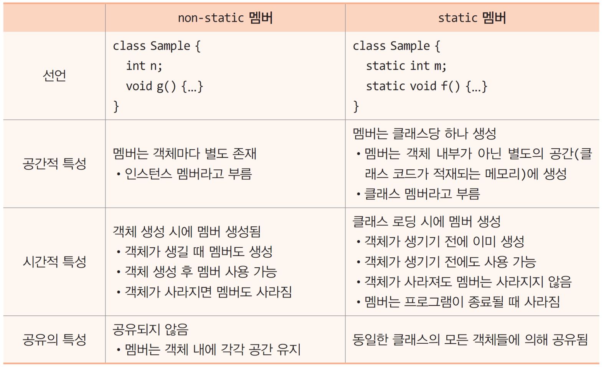

# 자바

```java
//public은 접근 지정자--> class에 접근하기 위함.
public class Hello{
	// 메소드
	public static int sum(int n, int m){
		return n + m;
		}
	// main() 메소드에서 실행 시작
	public static void main(String[] args){
		int i = 20;
		int s;
		char a;
		
		s = sum(i, 10); // sum() 메소드 호출
		a = '?';
		System.out.println(a); // 문자 '?' 화면 출력
		System.out.println("Hello"); // "Hello" 문자열 화면 출력
		System.out.println(s); // 정수 s 값 화면 출력
	}
}
```

class 내의 객체를 나타내는 것들을 **값**으로 표현 —> 명사(멤버 변수)
하위 개념으로, 값의 **기능**이 있음. —> 동사(메소드(함수의 기능))
메소드는 함수가 아니다 —> 메소드는 동적 메모리에 들어가기 때문에
*참고로, C언어 에서 함수는 스택에 들어간다.

선언할 때 자료형 앞에 final을 붙이면 상수로 선언되고 자료형이 변하지 않는다.
단 final을 붙이려면 초기화도 같이 해줘야한다.

```java
package example_00;

public class warning {

	public static void main(String[] args) {
		// TODO Auto-generated method stub
		int n = 200;
		byte b = (byte)n;
		
		System.out.println(b);
	}

}
// --> 200 - 127 = 73
// 이 73은 다시 byte 범위에서 -128부터 시작해서
// (-128) + 73 = -56 이 결과로 출력됨.
```

```java
package example_00;

public class example_2 {

	public static void main(String[] args) {
		// TODO Auto-generated method stub
		byte b = 127;
		int i = 100;
		
		System.out.println(b+i);                // 그대로 나옴
		System.out.println(10/4);               // 정수에서의 몫이므로 2
		System.out.println(10.0/4);             // 실수에서의 몫이므로 2.5
		System.out.println((char)0x12340041);   // 16진수의 숫자가 강제 타입 변환되어 0x41이 된다고 함.
		System.out.println((byte)(b+i));        // 227을 byte로 강제 형변환 하였음
		System.out.println((int)2.9+1.8);       // 정수형으로 형변환한 2.9는 2
		System.out.println((int)(2.9+1.8));     // 결과인 4.7을 정수형으로 형변환하였음
		System.out.println((int)2.9+(int)1.8);  // 각 숫자를 정수형으로 형변환하고 더했음
	}

}

```

Scanner 클래스
—> [System.in](http://System.in) 에게 키를 읽게 하고, 읽은 바이트를 문자, 정수, 실수, 불린, 문자열 등 다양한 타입으로 변환하여 리턴

```java
import java.util.Scanner;

Scanner a = new Scanner(System.in); // 스캐너 객체 생성
```

Scanner는 입력되는 키 값을 공백으로 구분되는 아이템 단위로 읽는다?

```java
Scanner scanner = new Scanner(System.in);

String name = scanner.next();

String city = scanner.next();

int age = scanner.nextInt();

double weight = scanner.nextDouble();

boolean single = scanner.nextBoolean();

// 스캐너는 기본적으로 문자열로 입력받기 때문에,
// 사용자의 의도에 맞는 타입의 next 함수를 입력하여야 한다.
```

```java
// '\n'을 포함하는 한 라인을 읽고 \'n'\을 버린 나머지 문자열 리턴
String nextLine()

// Scanner의 사용 종료
void close()

//현재 입력된 토큰이 있으면 true, 아니면 입력 때까지 무한정 대기
//새로운 입력이 들어올 때 true 리턴
//ctrl + z 키가 입력되면 입력 끝이므로 false 리턴
boolean hasNext()
```

ctrl shift o —> 누락된 라이브러리 import 자동
ctrl + space —> 프린트문 자동입력(다른것도 되는듯)

- 함수의 대입인자에 들어갈 수 있는 것들
—> 상수, 변수, 배열, 수식 등등 → ‘값’이 들어간다.
—> 제어문은 함수의 인자값으로 못 들어가기 때문에 이것을 조건문을 활용하여 연산자의 값으로 대입한다.

printf("%04x\n”) —> 결과 값을 16진수 형식으로 출력하는 프린트문
시프트 연산자 —> 숫자를 이진법으로 바꾸고 거기서 1을 이동시킴

배열 선언
배열은 자바에서는 객체로 관리한다.

```java
int intArray[] = new int[5];
// 자료형 배열[] = new 자료형[];
```

for each문

```java
for (String s : names) {
			System.out.println(s + " ");
		}System.out.println();
```

- 나열(enumeration) → enum, 함수 밖에서 정의함
—> enum은 클래스이다.

2차원 배열
[ ] [ ] 이렇게 두번 쓰면 됨.

```java
package example_02;

public class ScoreAverage {

	public static void main(String[] args) {
		double score[][] = {{3.3, 3.4}, // 1힉년 1, 2학기 평점
												{3.5, 3.6}, // 2학년 1, 2학기 평점
												{3.7, 4.0}, // 3학년 1, 2학기 평점
												{4.1, 4.2}};// 4학년 1, 2학기 평점
		double sum = 0;
		for(int year = 0;year<score.length;year++) {
			for (int term=0;term<score[year].length;term++) {
				sum += score[year][term];
			}
		}
		int n = score.length; // 배열의 행 개수
		int m = score[0].length; // 배열의 열 개수
		System.out.println("4년 전체 평점 평균은 " + sum/(n*m));
	}

}

```

비정방형 배열
정방형 → 각 행의 열 개수가 같은 배열
비정방형 → 각 행의 열 개수가 다른 배열
* 비정방형 배열의 길이는 각 행별로 다르므로, 이에 유념하여 코드를 작성

```java
// 비정방형 배열 선언, 정의 및 인자값 대입 / 출력
package example_02;

public class IrregularArray {

	public static void main(String[] args) {
		int intArray[][] = new int[4][];
		intArray[0] = new int[3];
		intArray[1] = new int[2];
		intArray[2] = new int[3];
		intArray[3] = new int[2];
		
		for(int i = 0; i < intArray.length; i++) {
			for (int j = 0; j<intArray[i].length;j++) {
				intArray[i][j] = (i+1)*10 + j;
			}
		}
		for (int i = 0;i<intArray.length;i++) {
			for (int j = 0; j<intArray[i].length;j++) {
				System.out.println(intArray[i][j] + " ");
			}System.out.println();
		}
	}

}
```

```java
// 밑변이 9개의 별 모양으로 장식된 정삼각형 출력
package example_02;

public class middle_homework {

	public static void main(String[] args) {
        for (int i = 1; i <= 5; i++) { // 높이가 5
            for (int j = 1; j <= 5 - i; j++) { // 좁아지도록
                System.out.print(" ");
            }

            for (int j = 1; j <= (2 * i - 1); j++) { // 역으로 좁아짐
                if (i == 5 || j == 1 || j == (2 * i - 1)) {
                    System.out.print("*");
                } else {
                    System.out.print(" ");
                }
            }System.out.println();
        }
	}
}
```

메소드에서 배열 리턴하기
메소드의 리턴 타입은
1. 메소드의 리턴 타입과 리턴 받는 배열 타입과 일치한다.
2. 리턴 타입에 배열의 크기를 지정하지 않는다.

(1) int[ ] intArray;
(2) makeArray( );
(3) intArray에 temp 값 치환
(4) intArray[0] = 5;
      …
      intArray[3] = 8;

```java
package example_02;

public class ReturnArray {
	
	static int[] makeArray() { // 정수형 배열 리턴 메소드
		int temp[] = new int[4]; // 배열 생성
		
		for(int i = 0; i < temp.length;i++)
			temp[i] = i; // 배열 원소 0, 1, 2, 3으로 초기화
		return temp;
	}

	public static void main(String[] args) {
		int intArray[]; // 배열 레퍼런스 변수 선언
		
		intArray = makeArray(); // 메소드로부터 배열 전달받기
		for (int i = 0; i < intArray.length;i++)
			System.out.print(intArray[i] + " ");

	}

}
```

# 클래스와 객체

두 개의 생성자를 가진 Circle_overloading 클래스

```java
package example_03;

public class Circle_overloading { // 생성자 이름은 클래스 이름과 같아야함.
	int radius;
	String name;
	
	public Circle_overloading() { // 생성자는 리턴 타입이 없다.
		radius = 1; name = "";
	}
	
	public Circle_overloading(int r, String n) {
		radius = r; name = n;
	}
	public double getArea() {
		return 3.14*radius*radius;
	}
	public static void main(String[] args) {
		Circle_overloading pizza = new Circle_overloading(10, "자바피자");
		
		double area = pizza.getArea();
		System.out.println(pizza.name + "의 면적은 " + area);
		
		Circle_overloading donut = new Circle_overloading();
		donut.name = "도넛피자";
		area = donut.getArea();
		System.out.println(donut.name + "의 면적은 " + area);
	}

}
```

생성자 특징
1) 생성자는 메소드
2) 생성자 이름은 클래스 이름과 반드시 동일해야함.
3) 생성자는 여러 개 작성 가능.(Overloading)
4) 생성자는 new를 통해 객체를 생성할 때, 객체당 한 번 호출
5) 생성자는 리턴 타입을 지정할 수 없음.
6) 생성자의 목적은 객체 초기화
7) 생성자는 객체가 생성될 때 반드시 호출됨—> 하나 이상 선언되어야 함.
—> 없으면 컴파일러가 자동으로 기본 생성자를 삽입함.
—> 클래스에 생성자가 하나 이상 작성된 경우, 기본 생성자 자동 삽입 X

this
—> 객체 자신에 대한 레퍼런스
—> this멤버 형태로 멤버 사용
—> 반드시 생성자 코드의 제일 처음에 수행

```java
public class Circle{
	int radius;
	
	public Circle() { this.radius = 1; }
	public Circle(int radius){
		this.radius = radius;
	}
	double getArea(){
		return 3.14*this.radius*this.radius;
	}
}
```

```java
// this 생성자 예시
package example_03;

public class Book1 {
	String title;
	String author;
	void show() { System.out.println(title + " " + author);}
	
	public Book1() {
		this("", "");
		System.out.println("생성자 호출됨");
	}
	public Book1(String title) {
		this(title, "작자미상");
	}
	public Book1(String title, String author) {
		this.title = title; this.author = author;
	}
	public static void main(String[] args) {
		Book1 littlePrince = new Book1("어린왕자", "생텍쥐페리");
		Book1 loveStory = new Book1("춘향전");
		Book1 emptyBook = new Book1();
		loveStory.show();

	}

}
```

객체의 치환? —> 객체가 복사되는 것이 아닌, 레퍼런스가 복사되는 것.

객체 배열 생성? —> 배열 레퍼런스 변수 선언 및 초기화 후, for문으로 객체 생성

```java
package example_03;
class Circle1{
	int radius;
	public Circle1(int radius) {
		this.radius = radius;
	}
	public double getArea() {
		return 3.14*radius*radius;
	}
}
public class CircleArray {
	public static void main(String[] args) {
		Circle1 [] c; // 선언
		c = new Circle1[5]; // 초기화
		
		for (int i = 0;i < c.length; i++){
			c[i] = new Circle1(i); // 인자값 지정
		}
		for (int i = 0; i < c.length;i++) {
			System.out.print((int)(c[i].getArea()) + " ");
		}
	}
}

```

인자 전달
1) 기본 타입의 값이 전달되는 경우 : 매개변수가 byte, int, double 등의 기본 타입 값일 때
2) 객체가 전달되는 경우 : 객체의 레퍼런스만 전달(매개 변수가 실인자 객체 공유)
3) 배열이 전달되는 경우 : 배열 레퍼런스만 매개 변수에 전달
—> 배열 통째로 전달되지 않고, 객체가 전달되는 경우는 동일, 매개변수가 실인자 배열 공유

```java
// 배열 전달 예시
package example_03;

public class ArrayParameterEx {
	static void replaceSpace(char a[]) {
		for (int i = 0; i < a.length; i++) {
			if (a[i] == ' ') {
				a[i] = ',';
			}
		}
	}
	static void printCharArray(char a[]) {
		for (int i = 0; i < a.length; i++) {
			System.out.print(a[i]);
		}System.out.println();
	}
	public static void main(String[] args) {
		char c[] = {'T', 'h', 'i', 's', ' ','i','s',' ','a', 
					' ', 'p', 'e', 'n', 'c', 'i', 'l','.'};
		printCharArray(c);
		replaceSpace(c);
		printCharArray(c);
	}
}
```

객체 소멸과 가비지 컬렉션
- 객체 소멸 —> new에 의해 할당된 객체 메모리를 가용 메모리로 되돌려 주는 행위
* 자바 응용프로그램에서 임의로 객체 소멸할 수 없다.
—> C언어나 C++에서는 개발자가 일일이 할당받은 객체를 되돌려 줘야하는데 자바는 자동.

- 가비지 컬렉션 —> 가리키는 레퍼런스가 없는 객체를 자동으로 반환하는 역할 수행

```java
// 예시
Person a, b;
a = new Person("이몽룡");
b = new Person("성춘향");
b = a; // --> 기존에 b가 가리키던 "성춘향"은 가비지가 된다.
```

접근 지정자

```java
// private 사용 예시
package example_03;

class Sample{
	public int a;
	private int b;
	protected int c;
}
public class AccessEx {
	public static void main(String[] args) {
		Sample aClass = new Sample();
		aClass.a = 10; // 접근 가능
		aClass.b = 10; // 접근 불가능
		aClass.c = 10; // 같은 패키지 내이므로 접근 가능
	}
}
```

static 멤버와 non-static 멤버



```java
// static 함수를 포함한 클래스 활용
package example_03;

class Calc{
	public static int abs(int a) { return a>0?a:-a;}
	public static int max(int a, int b) { return (a>b)?a:b;}
	public static int min(int a, int b) { return (a>b)?b:a;}
}

public class CalcEx {
	public static void main(String[] args) {
		System.out.println(Calc.abs(-5));
		System.out.println(Calc.max(10, 8));
		System.out.println(Calc.min(-3, -8));
	}
}
// Calc의 함수가 static 으로 선언되었으므로, 위와 같이 호출
```

static 메소드 제약 조건
1) static 메소드는 non-static 멤버에 접근할 수 없다.( non-static 메소드는 static 사용 가능)

final 클래스? —> 클래스 상속 및 오버라이딩 불가
—> 상수를 선언할 때 사용한다. ( const 같은 것인듯?)

super() 을 활용한 명시적 슈퍼 클래스 생성자 선택

```java
package example_05;

class Point{
	private int x, y;
	public Point() {
		this.x = this.y = 0;
	}
	public Point(int x, int y) {
		this.x = x; this.y = y;
	}
	public void showPoint() {
		System.out.println("(" + x + "," + y + ")");
	}
}
class ColorPoint extends Point{
	private String color;
	public ColorPoint(int x, int y, String color) {
		super(x, y); // Point 클래스의 생성자 호출
		this.color = color;
	}
	public void showColorPoint() {
		System.out.print(color);
		showPoint();
	}
}
public class showColorPoint {
	public static void main(String[] args) {
		ColorPoint cp = new ColorPoint(5, 6, "blue");
		cp.showColorPoint();
	}
}
```

업캐스팅?
—> 서브 클래스(상속) 객체를 슈퍼 클래스 타입으로 타입 변환

```java
Animal myDog = new Dog(); // 업캐스팅 (Dog 객체를 Animal 타입으로 선언)

myDog.eat();  // 가능 (부모인 Animal에 정의됨)
// myDog.bark(); // 불가능! (Animal 타입 변수로는 Dog의 고유 기능을 못 봄)
```

다운캐스팅?
—> 슈퍼 클래스 객체를 서브 클래스 타입으로 변환(개발자가 명시적으로 타입 변환해야함)

```java
Animal myAnimal = new Dog(); // 1. 업캐스팅 (자동)
myAnimal.eat();             // 가능
// myAnimal.bark();         // 불가능 (Animal 타입이라서 안 보임)

Dog myDog = (Dog)myAnimal;   // 2. 다운캐스팅 (강제 형변환)
myDog.bark();               // 이제 가능! (Dog 타입으로 돌아왔기 때문)
```

instanceof 연산자?
—> 레퍼런스가 가리키는 객체의 타입 식별을 위해 사용.
—> 사용법 : 객체레퍼런스 instanceof 클래스타입

메소드 오버라이딩
—> 슈퍼 클래스의 메소드를 서브 클래스에서 재정의
—> 동적 바인딩이 발생
→(서브 클래스에 오버라이딩된 메소드가 무조건 실행되는 것)

오버라이딩
—> 수퍼 클래스에 선언된 메소드를 각 서브 클래스들이 자신만의 내용으로 새로 구현하는 기능
—> 상속을 통해 하나의 인터페이스에 서로 다른 내용 구현이라는 객체 지향의 다형성 실현

```java
package example_05;

class Shape{ // 슈퍼 클래스
	public Shape next;
	public Shape() {next = null;}
	
	public void draw() {
		System.out.println("Shape");
	}
}
class Line extends Shape{
	public void draw() {
		System.out.println("Line");
	}
}
class Rect extends Shape{
	public void draw() {
		System.out.println("Rect");
	}
}
class Circle extends Shape{
	public void draw() {
		System.out.println("Circle");
	}
} // 3개의 클래스를 메소드 오버라이딩

public class MethodOverridingEx {
	static void paint(Shape p) {
		p.draw(); // p가 가리키는 객체 내에 오버라이딩된
	}           // draw() 호출, 동적 바인딩
	public static void main(String[] args) {
		Line line = new Line();
		paint(line);
		paint(new Shape());
		paint(new Line());
		paint(new Rect());
		paint(new Circle());
	}
}
```

super는 슈퍼 클래스의 멤버를 접근할 때 사용되는 레퍼런스


추상 메소드
—> 선언되어 있으나 구현되어 있지 않은 메소드
—> abstract로 선언
—> 추상 메소드는 서브 클래스에서 오버라이딩하여 구현해야 함
—> 추상 클래스는 클래스 앞에 abstract 라고 선언해야함

인터페이스
—> 자바8부터 인터페이스는 상수와 추상메소드 포함
—> default, private, static 메소드 포함 가능

```java
interface PhoneInterface{
	public static final int TIMEOUT = 10000;
	public abstract void sendCall();
	public abstract void receiveCall();
	public default void printLogo(){
		System.out.println("** Phone **");
	};
}
```

인터페이스 구성 요소
—> 상수, 추상 메소드, default 메소드, private 메소드, static 메소드

- 인터페이스 객체 생성 불가
- 인터페이스 타입의 레퍼런스 변수 선언 가능
- 다른 인터페이스 상속, 다중상속 가능
- 구현 시 인터페이스를 상속받는 클래스는 인터페이스의 모든 추상 메소드 반드시 구현해야함

인터페이스 추상 메소드를 모두 구현한 클래스 작성?
—> implements 키워드 사용하여 여러 개의 인터페이스 동시 구현

```java
package example_05;

interface PhoneInterface{     // 인터페이스 선언
	final int TIMEOUT = 10000;
	void sendCall();            // 추상 메소드
	void receiveCall();         // 추상 메소드
	default void printLogo() {  // default 메소드
		System.out.println("** Phone **");
	}
}
// PhoneInterface의 모든 추상 메소드 구현
class SamsungPhone implements PhoneInterface{
	@Override
	public void sendCall() {
		System.out.println("띠리링");
	}
	@Override
	public void receiveCall() {
		System.out.println("전화가 왔습니다.");
	}
	// 메소드 추가 작성
	public void flash() { System.out.println("전화기에 불이 켜졌습니다.");}
}

public class InterfaceEx {
	public static void main(String[] args) {
		SamsungPhone phone = new SamsungPhone();
		phone.printLogo();
		phone.sendCall();
		phone.receiveCall();
		phone.flash();
	}
}
```


---

---

---

**모듈과 패키지, 자바 기본 패키지**

패키지 특징: 계층구조, 접근제한, 높은 소프트웨어 재사용성


Wrapper 클래스?

```java
package example_05;

public class WrapperEx {
	public static void main(String[] args) {
		System.out.println(Character.toLowerCase('A'));
		char c1 = '4', c2 = 'F';
		if(Character.isDigit(c1))
			System.out.println(c1 + "는 숫자");
		if (Character.isAlphabetic(c2))
			System.out.println(c2 + "는 영문자");
		
		System.out.println(Integer.parseInt("-123"));
		System.out.println(Integer.toHexString(28));
		System.out.println(Integer.toBinaryString(28));
		System.out.println(Integer.bitCount(28));
		
		Double d = Double.valueOf(3.14);
		System.out.println(d.toString());
		System.out.println(Double.parseDouble("3.14"));
		
		boolean b = (4>3);
		System.out.println(Boolean.toString(b));
		System.out.println(Boolean.parseBoolean("false"));
	}
}
```

박싱? —> 기본 타입의 값을 Wrapper 객체로 변환
언박싱 —> Wrapper 객체에 들어 있는 기본 타입의 값 추출

```java
package example_05;

public class AutoBoxinfUnBoxingEx {
	public static void main(String[] args) {
		int n = 10;
		Integer intObject = n;
		System.out.println("intObject = " + intObject);
		
		int m = intObject + 10;
		System.out.println("m = " + m);
	}
}
```

String 생성자
1) String(char[ ] value) > char 배열 문자들을 스트링 객체로 생성
2) String(String original) > 매개변수 문자열과 동일 스트링 객체 생성
3) String(StringBuffer buffer) > 매개변수 스트링 버퍼의 문자열을 스트링 객체로 생성


문자열 비교 함수 —> int compareTo(String anotherString)
—> 문자열이 같으면 0 리턴
—> 이 문자열이 anotherString보다 사전에 먼저 나오면 음수 리턴
—> 이 문자열이 anotherString보다 사전에 나중에 나오면 양수 리턴

```java
package example_05;

public class StringEx {
	public static void main(String[] args) {
		String a = new String(" C#");
		String b = new String(",C++ ");
		System.out.println(a + "의 길이는 " + a.length()); // 문자열의 길이(문자 개수)
		System.out.println(a.contains("#")); // 문자열의 포함 관계
		a = a.concat(b); // 문자열 연결
		System.out.println(a);
		a = a.trim(); // 문자열 앞 뒤의 공백 제거
		System.out.println(a);
		a = a.replace("C#","Java"); // 문자열 대치
		System.out.println(a);
		String s[] = a.split(","); // 문자열 분리
		for (int i=0; i<s.length; i++)
		System.out.println("분리된 문자열" + i + ": " + s[i]);
		a = a.substring(5); // 인덱스 5부터 끝까지 서브 스트링 리턴
		System.out.println(a);
		char c = a.charAt(2); // 인덱스 2의 문자 리턴
		System.out.println(c);
	}
}
```