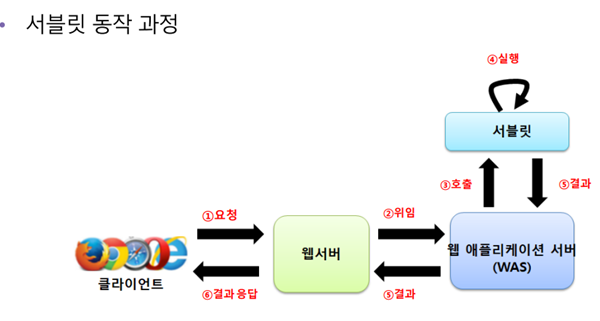

# 서블릿

---

---

---

서블릿
: 서버 쪽에서 실행되면서 클라이언트의 요청에 따라 동적으로 서비스를 제공하는 자바 클래스

특징
1. 서버 쪽에서 실행되면서 기능 수행
2. 동적인 여러 가지 기능 제공
3. 스레드 방식 실행
4. 자바 특징(객체 지향 등)을 가짐
5. 컨테이너에서 실행
6. 플랫폼 독립적
7. 보안 기능 적용 용이
8. 웹 브라우저에서 요청 시 기능 수행

---

서블릿 API 계층 구조와 기능 추가

→ GenericServlet 추상클래스는 Servlet 과 ServletConfig 인터페이스를 구현
→ HttpServlet 은 GenericServlet 추상클래스를 상속받음

---

서블릿 API 기능

| 서블릿 구성요소 | 기능 |
| --- | --- |
| Servlet 인터페이스 |   • Servlet 관련 추상 메서드를 선언한다.
  • init(), service(), destroy(), getServletInfo(), getServletConfig()를 선언한다. |
| ServletConfig 인터페이스 |   • Servlet 기능 관련 추상 메서드가 선언되어 있다.
  • getInitParameter(), getInitParameterNames(), getServletContext(), getServletName()이 선언되어 있다. |
| GenericServlet 클래스 |   • 상위 두 인터페이스를 구현하여 일반적인 서블릿 기능을 구현한 클래스이다.
  • GenericServlet을 상속받아 구현한 사용자 서블릿은 사용되는 프로토콜에 따라 각각 service()를 오버라이딩해서 구현한다. |
| HttpServlet 클래스 |   • GenericServlet을 상속받아 HTTP 프로토콜을 사용하는 웹 브라우저에서 서블릿 기능을 수행한다.
  • 웹 브라우저 기반 서비스를 제공하는 서블릿을 만들 때 상속받아 사용한다.
  • 요청 시 service()가 호출되면서 요청 방식에 따라 doGet() 이나 doPost() 가 차례로 호출된다. |

---

HttpServlet 클래스의 메서드 기능

| 메서드 | 기능 |
| --- | --- |
| protected doDelete(HttpServletRequest req,
HttpServletResponse resp) | 서블릿이 DELETE request를 수행하기 위해 service()를 통해서 호출된다. |
| protected doGet(HttpServletRequest req,
HttpServletResponse resp) | 서블릿이 GET request를 수행하기 위해 service()를 통해 호출된다. |
| protected doHead(HttpServletRequest req,
HttpServletResponse resp) | 서블릿이 HEAD request를 수행하기 위해 service()를 통해 호출된다. |
| protected doPost(HttpServletRequest req,
HttpServletResponse resp) | 서블릿이 POST request를 수행하기 위해 service()를 통해 호출된다. |
| protected service (HttpServletRequest req,
HttpServletResponse resp) | 표준 HTTP request를 public service()에서 전달받아 doXXX() 메서드를 호출한다. |
| public service (HttpServletRequest req,
HttpServletResponse resp) | 클라이언트의 request를 protected service()에게 전달한다. |

클라이언트 요청 → public service() 호출 → protected service() 호출 → doXXX() 호출

---

서블릿 생명주기? 메서드
: 서블릿 실행 단계마다 호출되어 기능을 수행하는 콜백 메서드

기능

| 생명 주기 단계 | 호출 메서드 | 기능 |
| --- | --- | --- |
| 초기화 | init() |   • 서블릿 요청 시 맨 처음 한 번만 호출된다.
  • 서블릿 생성 시 초기화 작업을 수행한다. |
| 작업 수행 | doGet()
doPost() |   • 서블릿 요청 시 매번 호출된다.
  • 실제로 클라이언트가 요청하는 작업을 수행한다. |
| 종료 | destroy() |   • 서블릿이 기능을 수행하고 메모리에서 소멸될 때 호출된다.
  • 서블릿의 마무리 작업을 수행한다. |
- init() 과 destroy() 메서드는 생략 가능하나, doXXX() 메서드는 반드시 구현해야 한다.

---

서블릿 생성 과정

1. 사용자 정의 서블릿 클래스 만들기
2. 서블릿 생명주기 메서드 구현
3. 서블릿 매핑 작업
4. 웹 브라우저에서 서블릿 매핑 이름으로 요청

---

사용자 정의 서블릿 클래스 만들기
: init(), doGet(), doPost(), destroy() 메서드를 오버라이딩해서 구현

---