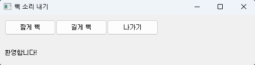

# Computer Vision

---

컴퓨터 비전

엣지 검출 알고리즘

- 물체 내부는 명암이 서서히 변하고 경계는 급격히 변하는 특성을 활용한다.

---

허프 변환?

- 끊긴 엣지를 모아 직선 또는 원 등을 검출시키는 것?
- 직선 검출 원리
- 각각의 점에 대해 공간에 직선 b=-ax + y를 그린다.
- (b, a) 공간에서 직선이 만나는 점을 절편과 기울기로 취한다. 만나는 점은 투표로 알아낸다?

---

비 최대 억제?

허프 변환과 최소평균제곱오차?

- 강인하지 않은 추정 기법…?
- 아웃라이어를 걸러내는 기능이 전혀 없다(모든 점에 같은 기회를 부여한다)

---

강인한 추정 기법?

- RANSAC 기법 à 구체적인 문제에 활용
- 난수를 생성하여 추정하는 일을 충분히 많이 반복하고, 가장 신뢰할 수 있는 값 선택

레이블링 à 픽셀을 영역으로 나눌 때, 각 영역을 넘버링 하는 것

---

Localization

- 반복성, 불변성, 분별력, 지역성, 적당한 양, 계산 효율 필요

SIFT à 특징점 추출할 때 활용

1) 다중 스케일 영상 구축

2) 다중 스케일 영상에 미분 적용(정규 라플라시안 사용, 시간이 많이 걸리면 DOG 사용)

---

지능 에이전트
: 센서를 통해 환경을 자각하고 액츄에이터를 통해 환경에 행동을 가한다고 볼 수 있는 모든 것

- PyQt 라이브러리를 활용한 GUI 구현 예시

```cpp
from PyQt5.QtWidgets import *
import sys
import winsound

class BeepSound(QMainWindow):
    def __init__(self) :
        super().__init__()
        self.setWindowTitle('삑 소리 내기') 		# 윈도우 이름과 위치 지정
        self.setGeometry(200,200,500,100)

        shortBeepButton=QPushButton('짧게 삑',self)	# 버튼 생성
        longBeepButton=QPushButton('길게 삑',self)
        quitButton=QPushButton('나가기',self)
        self.label=QLabel('환영합니다!',self)
        
        shortBeepButton.setGeometry(10,10,100,30)	# 버튼 위치와 크기 지정
        longBeepButton.setGeometry(110,10,100,30)
        quitButton.setGeometry(210,10,100,30)
        self.label.setGeometry(10,40,500,70)
        
        shortBeepButton.clicked.connect(self.shortBeepFunction) # 콜백 함수 지정
        longBeepButton.clicked.connect(self.longBeepFunction)         
        quitButton.clicked.connect(self.quitFunction)
       
    def shortBeepFunction(self):
        self.label.setText('주파수 1000으로 0.5초 동안 삑 소리를 냅니다.')   
        winsound.Beep(1000,500)
        
    def longBeepFunction(self):
        self.label.setText('주파수 1000으로 3초 동안 삑 소리를 냅니다.')        
        winsound.Beep(1000,3000) 
                
    def quitFunction(self):
        self.close()
                
app=QApplication(sys.argv) 
win=BeepSound() 
win.show()
app.exec_()
```



---

- GrabCut을 활용한 관심 물체 오림 가능

---

- 파노라마 → OpenCV의 sticth 함수 활용

```cpp
def stitchFunction(self):
  stitcher=cv.Stitcher_create()
  status,self.img_stitched=stitcher.stitch(self.imgs)
  if status==cv.STITCHER_OK:
      cv.imshow('Image stitched panorama',self.img_stitched)     
  else:
      winsound.Beep(3000,500)            
      self.label.setText('파노라마 제작에 실패했습니다. 다시 시도하세요.')    
      
```

---

- 특수 효과를 위한 함수
1. cv.stylization

```cpp
cv.stylization(self.img,sigma_s=60,sigma_r=0.45) 
```

매개변수
1.  src: 입력 영상(8비트 3채널 입력 영상)
2. sigma_s: 스무딩을 위한 가우시안의 표준편차 (0 ~ 200범위)
3. sigma_r: 양방향 필터가 사용하는 두 번째 가우시안의 표준편차(0~1)
반환값
1. dst: 특수 효과 처리된 영상(8비트 3채널 영상)

1. pencilSketch

---

```cpp
cv.pencilSketch(self.img,sigma_s=60,
								sigma_r=0.07,
								shade_factor=0.02)

```

매개변수
- 위 stylization 매개변수에 추가로
4. shade_factor: 출력 영상의 밝은 정도(0 ~ 0.1 범위)
반환값
1. dst1: 특수 효과 처리된 명암 영상(8비트 1채널 영상)
2. dst2: 특수 효과 처리된 컬러 영상(8비트 3채널 영상)

---

1. xphoto.oilPainting

```cpp
cv.xphoto.oilPainting(src, size, dynRatio,, code)
```

---

딥 러 닝

기계학습
데이터 수집→모델 선택→학습→예측

1단계: 데이터 수집
모델의 입력은 특징 벡터, 출력은 참값

- 회귀는 레이블이 연속 값
- 분류는 레이블이 이산
- 3단계 학습
→ 훈련 집합에 있는 샘플을 최소 오류로 맞히는 최적의 가중치 값을 알아내는 작업
→ 기계학습의 경우 수치적 방법 사용
- 4단계 예측
→ 학습 완료 모델에 새로운 특징 벡터를 입력하고 출력을 구하는 과정

---

퍼셉트론
→ 딥 러닝 이론의 토대이자 핵심 부품

두 개의 퍼셉트론으로 특징 공간 변환
→ 새로운 특징 공간은 선형 분리 가능
→ 새로운 특징 공간을 은닉 공간 또는 잠복 공간이라고 부름

---

컨볼루션 신경망(CNN)

컨볼루션층
- 입력 특징 맵이 m*n*k 텐서라면, h*h*k 필터 사용
- 하나의 필터는 바이어스 하나를 가짐 (kh^2 + 1개의 가중치)
- 필터를 여러 개(k’개) 적용하여 풍부한 특징 맵 추출
- 출력 특징 맵은 m*n*k’ 텐서
- 덧대기와 보폭
표준 컨볼루션 대비, 위 내용에 대한 확장이 필요하다.

가중치 공유와 부분 연결성
: 입력 특징 맵의 모든 화소가 같은 필터를 사용함에 있어, 가중치를 공유하는 것과 같다.
  필터는 해당 화소 주위에 국한하여 연산 수행. 가중치 개수가 획기적으로 줄어든다.

풀링층
- 최대 풀링은 필터 안의 화소의 최대값을 취한다.
- 평균 풀링은 필터 안의 화소의 평균값을 취한다.
- 지나친 상세함을 줄이는 효과와 특징 맵의 크기를 줄이늖 효과가 있다.

빌딩블록 쌓기?
- 보통 컨볼루션층과 풀링층을 번갈아 쌓는다.
- 풀링층에서는 텐서 깊이가 유지된다.
- 신경망 앞 부분은 특징 추출, 뒷부분은 분류 담당

---

컨볼루션 신경망 학습
- 역전파 학습 알고리즘 사용
→ 컨볼루션층의 커널 화소와 온전연결층의 엣지가 가중치에 대당
→ 풀링층은 가중치 없음

- 특징 학습
: 학습 알고리즘은 주어진 데이터셋을 인식하는 데 최적인 필터를 찾아낸다.
- 통째 학습
: 특징 학습과 분류기 학습을 한꺼번에 진행한다.

-컨볼루션 신경망이 우수한 이유?
→ 데이터의 원래 구조를 유지한다.
→ 특징 학습을 통해 최적의 특징을 추출한다.
→ 신경망의 깊이를 깊게 한다.

---

Tensorflow 프로그래밍의 핵심 4모듈
1. Models API
2. Layers API
3. Optimizers
4. Losses

모델을 생성하는 Models 모듈
→ Sequential 은 한 갈래 Tensor가 끝까지 흐르는 경우
→ Functional API는 Tensor가 여러 갈래로 나뉘는 경우

층을 쌓는 layers 모듈
→ 완전연결층 Dense, 컨볼루션층 Conv2D, 최대 풀링층 MaxPooling2D, ….

손실 함수를 위한 losses 모듈
→ 평균제곱오차 MSE, 교차 엔트로피 categorical_crossentropy 등등

옵티마이저를 위한 optimizers 모듈
→ SGD, Adam, AdaGrad, RMSprop

---

손실 함수

- 신경망 초기에는 주로 평균제곱오차(MSE)를 사용
- 딥러닝에서는 분류를 위해서 교차 엔트로피를 주로 사용
교차 엔트로피: 참값 벡터와 예측 벡터를 확률 분포로 간주
                           두 확률 분포의 다른 정도를 측정해준다.

---

Focal 손실 함수
→ 부류 불균형이 심한 경우에 효과적

---

기본 옵티마이저 SGD를 개선하는 방법?
→ 모멘텀 적용, 적응적 학습률 적용

모멘텀
: 이전 운동량이 현재에 영향을 미치는 물리 법칙
  가중치 변경 이력이 현재 가중치에 영향을 끼친다.

적응적 학습률?
: 적응적 학습률에서는 상황에 따라 학습률을 조정한다.

---

과잉 적합이면, 훈련에 참여하지 않은 새로운 데이터에 대해 낮은 성능, 즉 일반화 능력이 약하다.

---

규제 기법
1. 데이터 증강
: 훈련 집합을 조금씩 변형하여 인위적으로 늘리는 것
  오프라인 방식과 온라인 방식으로 나뉘는데 주로 온라인을 사용한다.
2. 드롭아웃
: 특징 맵을 구성하는 요소 중 일부를 랜덤 선택하여 0으로 설정하여 학습에서 배제
  학습할 때만 적용하고 예측(추론) 과정에서는 적용을 안한다.
3. 조기 멈춤
: 성능 향상이 없으면 설정한 세대 수 이전에 학습을 멈춘다.

---

전이 학습
: 어떤 도메인의 데이터로 학습한 모델을 다른 도메인에 적용하여 성능을 향상하는 방법

---

백본 모델
→Tensorflow가 제공하는 사전 학습 모델

- VGGNet: 3*3 작은 마스크를 사용하고 층 깊이가 16
- GoogLeNet: 네트워크 속의 네트워크 아이디어가 적용됨
- ResNet: 지름길을 연결한 것이 적용됨

---

사전 학습 모델로 견종 인식!
→ Stanford dogs 데이터셋 활용

---

인식

세부 문제?
→ 사람과 달리 컴퓨터 비전은 세부 문제로 구분한다.
→ 세부 문제는 별도의 데이터셋과 성능 기준을 가지고 알고리즘을 개발한다.
분류, 검출, 분할, 추적, 행동 분류

분류
: 영상에 있는 물체의 부류를 알아냄. 보통 부류 확률 벡터를 출력함
  1) 사례 분류: 특정 물체를 알아내는 것
  2) 범주 분류: 물체 부류를 알아내는 것

검출
: 영상에서 물체를 찾아 직사각형으로 위치 표현
  보통 부류 확률도 같이 출력한다.

분할
: 물체가 점유하는 영역, 즉 화소 집합을 지정함
  의미 분할과 사례 분할이 있음

추적
: 비디오에 나타난 물체의 이동 궤적을 표시함
  시각 물체 추적과 다중 물체 추적이 있음

행동 분류
: 물체가 수행하는 행동의 종류를 알아냄

---

데이터셋과 방법론의 공진화

데이터셋 예
1) PASCAL VOC
: 20부류 50만장의 영상
2) ImageNet
: 21,841부류 1400만장의 영상
3) COCO
: 80부류 33만장의 영상
4) OpenImages

---

영상 레이블링
→ 많은 노동력이 필요하다. 검출 레이블링은 분류 레이블링보다 어렵고, 분할 레이블링은 검출 레이블링보다 어렵다.
→ 무료 레이블링 도구가 여럿 있다.
→ 대용량 데이터셋은 클라우소싱을 활용하여 제작한다.